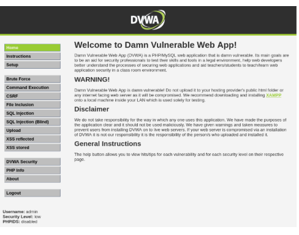
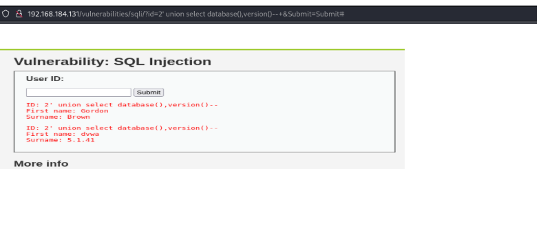

Penetration Testing on DVWA – SQL Injection Exploitation

Project Overview
This project demonstrates the ethical identification and exploitation of SQL Injection (SQLi) vulnerabilities in the Damn Vulnerable Web Application.
The objective of this assessment was to simulate a real-world attack scenario in a controlled lab environment and analyze how insecure coding practices can lead to database compromise.

This project reflects practical penetration testing skills including:
-Vulnerability identification
-Manual SQL Injection exploitation
-Database enumeration
-Impact analysis
-Secure mitigation strategies

Objective of the Assessment
The primary goals of this penetration testing activity were:
-To identify SQL Injection vulnerabilities in DVWA
-To exploit the vulnerability using manual and automated techniques
-To extract sensitive database information
-To analyze business impact
-To recommend mitigation strategies based on secure coding practices
-This assessment was conducted strictly for educational and ethical purposes.

Tools & Technologies Used
The testing was performed using industry-recognized security tools:
Kali Linux – Penetration testing operating system
Burp Suite – Intercepting proxy & request manipulation
SQLMap – Automated SQL Injection exploitation
 OWASP ZAP – Vulnerability scanning
 Apache Web Server
 MySQL Database
 PHP

🧪 Testing Environment
The environment was configured as follows:
-Component	Configuration
-Operating System	Kali Linux
-Web Server	Apache
-Database	MySQL
-Application	DVWA (Localhost)
-Testing Approach	Black-box & Grey-box

The target application was hosted locally to ensure safe experimentation.
Types of SQL Injection Demonstrated
During testing, multiple SQL Injection techniques were demonstrated:
1. Union-Based SQL Injection
Used UNION SELECT to retrieve additional data from the database.

2. Error-Based SQL Injection
Leveraged database error messages to gather schema information.

3. Blind SQL Injection
Extracted information using boolean-based responses when error messages were hidden.

4️.Time-Based Blind SQL Injection
Used time delays (e.g., SLEEP()) to infer database responses.

 Exploitation Process (Proof of Concept)
The exploitation was performed step-by-step:
Step 1: Access Application
Opened DVWA login page in browser.

Step 2: Vulnerability Detection
Inserted ' in the input field to test for SQL syntax errors.

Observation: Application returned database error → confirmed vulnerability.
Step 3: Column Enumeration
Used:
ORDER BY 1--
ORDER BY 2--
To determine number of columns.

Step 4: UNION Attack
Used:
UNION SELECT 1,2--
To identify injectable columns.

Step 5: Database Enumeration
Extracted:
Database name using database()
DB version using version()

Step 6: Table & Column Extraction
Queried information_schema to identify:
Table names
Column names

Step 7: Credential Extraction
Dumped usernames and hashed passwords.

⚠ Impact Analysis
If exploited in a real-world production system, this vulnerability could lead to:

Unauthorized access to confidential user data
 Data modification or deletion
 Full database dump
 Privilege escalation
 Financial and reputational loss

SQL Injection is considered critical severity because it directly impacts confidentiality, integrity, and availability (CIA Triad).
 Mitigation Strategies & Secure Coding Recommendations
To prevent SQL Injection vulnerabilities:

 1. Use Prepared Statements (Parameterized Queries)
Example:
$stmt = $pdo->prepare("SELECT * FROM users WHERE id = ?");
$stmt->execute([$userId]);
 2. Input Validation
Allow only expected data types (e.g., numeric IDs).
 3. Use Web Application Firewall (WAF)
Blocks malicious SQL patterns.
 4. Apply Least Privilege Principle
Restrict database user permissions.
 5. Disable Detailed Error Messages
Prevent database structure disclosure.
 6. Regular Security Audits
Conduct frequent VAPT assessments.

 📸 Screenshots

 1️⃣ DVWA Login Page

 2️⃣ SQL Injection Vulnerability Test
 

 3️⃣ Error-Based Injection

4️⃣ Column Enumeration (ORDER BY)

 5️⃣ UNION SELECT Attack
 

 6️⃣ Database Name Extraction
 

 7️⃣ Version Extraction
 

 8️⃣ Table Enumeration
 

 9️⃣ Column Enumeration
 

 🔟 User Credential Dump
 

